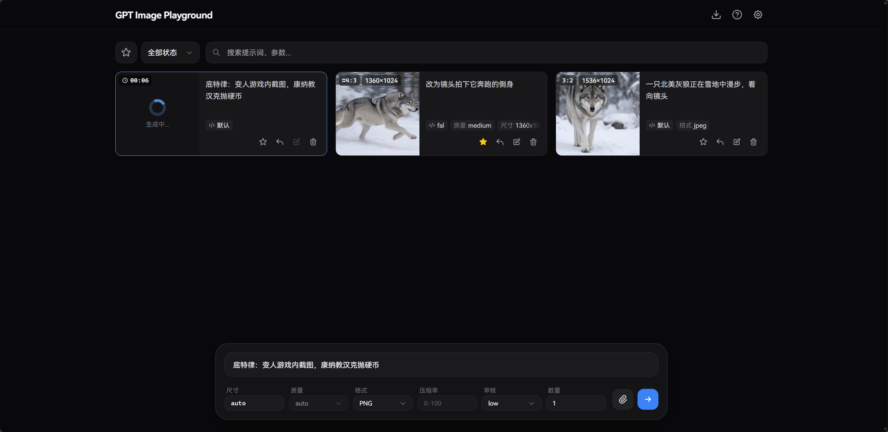

# GPT Image Playground

基于 OpenAI 图像生成接口的图片生成与编辑工具。提供简洁精美的 Web UI，支持文本生图、参考图与遮罩编辑，数据纯本地化存储，带来流畅的历史记录与参数管理体验。

> 若需调用非 HTTPS 的内网或本地 HTTP API，请使用 GitHub Pages 版本或自行部署，Vercel 部署的体验版绑定的 `.dev` 域名因安全策略通常要求接口必须为 HTTPS。

[**🌐 Vercel 在线体验**](https://gpt-image-playground.cooksleep.dev) &nbsp;|&nbsp; [**🌐 GitHub Pages 在线体验**](https://cooksleep.github.io/gpt_image_playground)

---

## 📸 界面预览

<details>
<summary><b>点击展开截图展示</b></summary>
<br>

<div align="center">
  <b>桌面端主界面</b><br>
  
</div>

<br>

<div align="center">
  <b>任务详情与实际参数</b><br>
  
</div>

<br>

<div align="center">
  <b>桌面端批量选择</b><br>
  
</div>

<br>

<div align="center">
  <b>移动端主界面</b><br>
  
</div>

<br>

<div align="center">
  <b>移动端侧滑多选</b><br>
  
</div>

</details>

---

## ✨ 核心特性

### 🎨 强大的图像生成与编辑
- **双模接口支持**：自由切换使用常规 `Images API` (`/v1/images`) 或 `Responses API` (`/v1/responses`)。
- **参考图与遮罩**：支持上传最多 16 张参考图（支持剪贴板和拖拽）。内置可视化遮罩编辑器，自动预处理以符合官方分辨率限制。
- **批量与迭代**：支持单次多图生成；一键将满意结果转为参考图，无缝开启下一轮修改。

### ⚙️ 精细化参数追踪
- **智能尺寸控制**：提供 1K/2K/4K 快速预设，自定义宽高时会自动规整至模型安全范围（16 的倍数、总像素校验等）。
- **实际参数对比**：自动提取 API 响应中真实生效的尺寸、质量、耗时以及**模型改写后的提示词**，与你的请求参数高亮对比。

### 📁 高效历史管理 (纯本地)
- **瀑布流与画廊**：历史任务自动保存，支持按状态过滤、全屏大图预览与快捷下载。
- **快捷批量操作**：桌面端支持鼠标拖拽框选、Ctrl/⌘ 连选，移动端支持顺滑侧滑多选；轻松实现批量收藏与清理。
- **极致性能与隐私**：所有记录与图片均存放在浏览器 IndexedDB 中（采用 SHA-256 去重压缩），不经过任何第三方服务器。支持一键打包导出 ZIP 备份。

### 🔌 API 兼容增强
- **Codex CLI 兼容模式**：专为非标准 API (如 Codex CLI) 打造。开启后自动固定无效参数，将 Images API 的多图请求拆分为并发单图。
- **提示词防改写**：Responses API 会始终在请求文本前加入强制指令防止提示词被改写；开启 Codex CLI 模式后，Images API 也会获得同等保护。

---

## 🚀 部署与使用

支持多种部署与使用方式，推荐使用 Vercel 一键部署。

<details>
<summary><strong>▲ 方式一：Vercel 一键部署 (推荐)</strong></summary>

[](https://vercel.com/new/clone?repository-url=https%3A%2F%2Fgithub.com%2FCookSleep%2Fgpt_image_playground&project-name=gpt-image-playground&repository-name=gpt-image-playground)

点击上方按钮后，按 Vercel 页面提示导入仓库即可。项目已包含 `vercel.json`，Vercel 会自动执行 `npm install`、`npm run build`，并将 `dist/` 作为静态输出目录。

如需预置默认 API 节点，可在 Vercel 项目的 **Settings → Environment Variables** 中添加：

```bash
VITE_DEFAULT_API_URL=https://api.openai.com/v1
```

部署完成后，打开 Vercel 分配的域名，在页面右上角设置中填入 API Key 即可使用。

**更新说明：**

本仓库已在 `vercel.json` 中关闭了 Vercel 的默认自动部署（防止日常提交和别人 PR 产生部署报错噪音）。

**如果你希望在同步了新的代码后自动让 Vercel 部署最新版**，请进行以下简单配置：

1. 打开你的 Vercel 项目设置：**Settings** -> **Git**。
2. 找到 **Deploy Hooks** 区域，起个名字（如 `Release`），Branch 填 `main`，然后点击 **Create Hook**。
3. 复制生成的专属 URL（形如 `https://api.vercel.com/v1/integrations/deploy/...`）。
4. 打开你 Fork 的 GitHub 仓库设置：**Settings** -> **Secrets and variables** -> **Actions**。
5. 点击 **New repository secret**，名称填 `VERCEL_DEPLOY_HOOK`，值粘贴你刚才复制的 URL，然后保存。

配置完成后，当你每次在 GitHub 页面点击 **Sync fork** 同步了上游最新的版本 Tag 时，仓库里的 GitHub Action 就会自动帮你触发 Vercel 进行构建和部署。

*如果你不配置这个 Secret，项目将不会自动部署。你需要每次在 GitHub 页面点击 **Sync fork** 后，手动在 Vercel 项目的 **Deployments** 页面点击 Redeploy 来更新。*

</details>

<details>
<summary><strong>🐳 方式二：Docker 部署</strong></summary>

项目已将镜像发布至 GitHub Container Registry。你可以通过环境变量 `API_URL` 注入默认的 API 节点，也可以通过 `HOST`、`PORT` 指定容器内 nginx 的监听地址，默认值为 `0.0.0.0:80`。

**使用 Docker CLI：**

```bash
docker run -d -p 8080:80 \
  -e API_URL=https://api.openai.com/v1 \
  ghcr.io/cooksleep/gpt_image_playground:latest
```

使用 host 网络并监听宿主机 `28080` 端口：

```bash
docker run -d --network host \
  -e HOST=0.0.0.0 \
  -e PORT=28080 \
  -e API_URL=https://api.openai.com/v1 \
  ghcr.io/cooksleep/gpt_image_playground:latest
```

**使用 Docker Compose：**

```yaml
services:
  gpt-image-playground:
    image: ghcr.io/cooksleep/gpt_image_playground:latest
    environment:
      - API_URL=https://api.openai.com/v1
    ports:
      - "8080:80"
    restart: unless-stopped
```

浏览器访问 `http://localhost:8080`，在页面右上角设置中填入 API Key 即可使用。

如果你的 API 节点没有放开浏览器跨域，可以用环境变量 `ENABLE_API_PROXY=true` 开启容器内 Nginx 代理。开启后，设置面板才会展示 **API 代理** 开关；用户启用该开关后，浏览器会请求同源的 `/api-proxy/`，由容器内 Nginx 转发到部署端配置的 `API_URL`。

⚠️ **安全警告**：开启 `ENABLE_API_PROXY=true` 后，任何人都能将你的服务器作为代理来请求目标 API。虽然请求本身仍需携带有效的 API Key 才能成功，但这可能会消耗你的服务器带宽。如果目标 API 是内网服务或基于 IP 白名单免密访问，则存在被未经授权调用的风险。建议仅在本地开发或有访问控制（如 IP 白名单、前置认证机制等）的环境中开启此功能。

如果使用 bridge 网络并修改了容器内 `PORT`，需要同步调整端口映射，例如 `PORT=28080` 时使用 `"8080:28080"`。使用 host 网络时不要配置 `ports`。

*(注：官方镜像同时提供带版本号的标签，如 `0.1.11` 或 `0.1`)*

**更新说明：**

- 使用 `latest` 标签时，重新拉取镜像并重启容器即可更新到最新发布版本。
- 如果希望固定版本，建议使用明确版本号标签，例如 `ghcr.io/cooksleep/gpt_image_playground:0.2.3`。
- Docker Compose 更新示例：

```bash
docker compose pull
docker compose up -d
```

</details>

<details>
<summary><strong>💻 方式三：本地开发与自行构建</strong></summary>

1. **环境准备 (可选)**
   你可以在项目根目录新建 `.env.local` 文件，配置构建时的默认 API URL：
   ```bash
   VITE_DEFAULT_API_URL=https://api.openai.com/v1
   ```

2. **安装依赖与启动开发服务器**
   ```bash
   npm install
   npm run dev
   ```
   随后浏览器访问 `http://localhost:5173`。

3. **本地开发跨域代理（可选）**
   如果你的图片接口没有放开浏览器跨域，前端直接请求接口时可能会被浏览器的 CORS 策略拦截。这个可选代理用于本地开发调试：开启页面设置中的 **API 代理** 后，浏览器先请求同源的 Vite 开发服务器，再由 Vite 开发服务器转发到真实接口。

   请求链路如下：

   ```text
   浏览器页面 http://localhost:5173
     -> 同源请求 http://localhost:5173/api-proxy/v1/images/generations
     -> Vite 开发服务器代理转发
     -> 真实接口 http://127.0.0.1:3000/v1/images/generations
   ```

   选择 Responses API 时，同一代理配置会将请求改写为 `/api-proxy/v1/responses`。

   这样浏览器看到的是同源请求，实际跨域请求发生在 Vite 开发服务器这一侧，从而绕开浏览器 CORS 限制。

   注意：这个开发代理只在 `npm run dev` 启动的 Vite 开发服务器中生效。它不会打包进静态产物，也不会在 Vercel、GitHub Pages 或普通 Nginx 静态部署中生效。Docker 镜像内置了 Nginx 代理，可以通过环境变量 `ENABLE_API_PROXY=true` 开启（默认关闭）。

   先复制示例配置：
   ```bash
   cp dev-proxy.config.example.json dev-proxy.config.json
   ```
   然后修改项目根目录下的本地 `dev-proxy.config.json`：
   ```json
   {
     "enabled": true,
     "prefix": "/api-proxy",
     "target": "http://127.0.0.1:3000",
     "changeOrigin": true,
     "secure": false
   }
   ```
   配置含义：

   - `enabled`：是否启用本地开发代理。
   - `prefix`：前端同源请求使用的代理路径前缀。
   - `target`：真实图片接口地址，也就是 Vite 开发服务器要转发到的后端。
   - `changeOrigin`：转发时是否把请求头中的 `Host` 改成 `target` 的主机名，通常建议保持 `true`。
   - `secure`：当 `target` 是 HTTPS 时是否校验证书；本地自签名证书可设为 `false`。

   修改配置后需要重新启动开发服务器，并在页面设置中的 `API URL` 填入与 `target` 相同的地址，然后开启 **API 代理**。开启后，请求会改写为 `prefix` 开头的同源地址，例如 `/api-proxy/v1/images/generations` 或 `/api-proxy/v1/responses`。

   > 如果 `target` 或填入的 `API URL` 已经包含了 `/v1` 路径，则同源请求的路径将不再重复拼接 `/v1`，例如会直接变为 `/api-proxy/responses`

   如果需要在非 Docker 的线上部署中使用代理，请使用 Vercel Function、Cloudflare Worker、Nginx 反向代理或自建后端等服务端方案。

4. **构建静态产物**
   ```bash
   npm run build
   ```
   构建输出的文件会存放在 `dist/` 目录下，你可以将其部署到任何静态文件服务器（如 Nginx、Vercel、Netlify 等）。

</details>

---

## 🛠️ API 配置与 URL 传参

点击页面右上角的 **设置 (⚙️)**，可以配置模型与密钥。

- **Images API**：调用 `/v1/images/generations` 和 `/v1/images/edits`，模型需要填写 GPT Image 模型，例如 `gpt-image-2`。
- **Responses API**：调用 `/v1/responses` 并使用 `image_generation` 工具，模型需要填写支持该工具的文本模型，例如 `gpt-5.5`。请求文本会始终加入简短的不改写要求，避免模型重写提示词，偏离原意。
- **API 代理**：开启后，浏览器会请求同源的 `/api-proxy/` 路径，再由当前后端转发到真实 API，用于绕开浏览器 CORS 限制。代理目标由部署端配置决定，例如 Docker 中的 `API_URL` 或本地开发的 `dev-proxy.config.json`。
- **Codex CLI 模式**：如果你在使用源于 Codex CLI 的 API，可以在 `API URL` 右侧开启该模式。开启后应用不会向任何接口发送 `quality` 参数，界面中的质量选项也会固定为 `auto`；使用 Images API 时，还会在提示词文本开头加入简短的不改写要求。
- Codex CLI 模式下，Images API 的图片数量会通过并发发起多个单图请求实现；Responses API 原本也通过并发请求实现多图生成。
- 如果检测到接口返回的提示词被改写，或缺少官方 API 通常会返回的部分信息，应用会提示是否为当前 `API URL + API Key` 组合开启 Codex CLI 模式；取消后，同一组合不再重复询问。

应用支持通过 URL 查询参数快速填充配置，非常适合书签或分享给他人使用：
- `?apiUrl=https://你的代理地址.com`
- `?apiKey=sk-xxxx`
- `?apiMode=images` 或 `?apiMode=responses`，未传时默认使用 `images`
- `?codexCli=true` 或 `?codexCli=false`，未传时默认关闭，仅 `true` 会开启 Codex CLI 模式

例如：
- 接入 New API 聊天应用：
  ```text
  https://gpt-image-playground.cooksleep.dev?apiUrl={address}&apiKey={key}
  ```

  ```text
  https://cooksleep.github.io/gpt_image_playground?apiUrl={address}&apiKey={key}
  ```

---

## 💻 技术栈

- **前端框架**：[React 19](https://react.dev/) + [TypeScript](https://www.typescriptlang.org/)
- **构建工具**：[Vite](https://vite.dev/)
- **样式方案**：[Tailwind CSS 3](https://tailwindcss.com/)
- **状态管理**：[Zustand](https://zustand.docs.pmnd.rs/)

## 📄 许可证 & 致谢

本项目基于 [MIT License](LICENSE) 开源。

特别致谢：[LINUX DO](https://linux.do)

## ⭐ Star History

[](https://www.star-history.com/#CookSleep/gpt_image_playground&Date)
